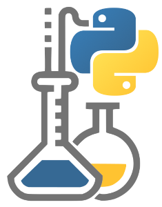

# Python Libraries

In order to promote SciCat adoption and lower the barrier to data and metadata usage, the SciCat community has worked on creating python libraries to access the scicat backend endpoint.

There are two scicat python libraries, which serves two different use cases:
- pyscicat ([repository](https://github.com/SciCatProject/pyscicat))  
    
  This is a lower library providing a function for each backend endpoint.  
  The use case for this library is for expert programmers that are developing third-party tools, like ingestors and analysis tools.
  It requires to have experience with REST apis and be familiar with the intricacies of SciCat data models.
  At the time of this writing, pyscicat is funcitonal but not complete and is lacking some endpoints.  

- scitacean([repository](https://github.com/SciCatProject/scitacean), [documentation](https://scicatproject.github.io/scitacean/))  
  
  This is a high level library that hides the scicat intricacies of scicat and allows user to access their datasets, associated metadata and files. The intended audience for this library are scientist and users that are performing data exploration and are leveraging SciCat  to select and retrieve their data.